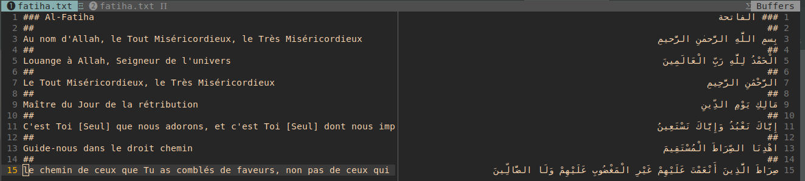

# Tariha api

---

This API aims to make it easy for anyone to read, study, and learn xassidas of different senegalese authors from different Tariha. The project is open source and is built as a collaboration between core team members.

#### Installation

**Requirements**

- **Python 3.9 and later**
  
  ```bash
  pip install -r requirements.txt
  ```

#### Folder Structure

```bash
── README.md
├── api
├── data
│   ├── example.png
│   └── xassida
│       └── tidjian
│           ├── elhadj-malick-sy
│           │   ├── khilass-zahab
│           │   │   ├── en
│           │   │   │   └── khilass-zahab.txt
│           │   │   ├── fr
│           │   │   │   └── khilass-zahab.txt
│           │   │   └── khilass-zahab.txt
│           │   └── xassidas.json
│           └── serigne-babacar
│               └── xassidas.json
├── db.sqlite3
├── manage.py
├── requirements.txt
├── utils
│   ├── db
│   │   ├── helpers.py
│   │   └── insert.py
│   └── parser
│       ├── __init__.py
│       ├── models.py
│       ├── parse_author.py
│       ├── parse_translations.py
│       ├── parse_xassida.py
│       └── transcription
│           ├── __init__.py
│           ├── arabic_alphabet.py
│           ├── arabic_text.py
│           ├── buckwalter.py
│           ├── phonetic.py
│           └── types
│               ├── __init__.py
│               └── linked_queue.py
└── xassida
```

#### Global usage

#### Server

```bash
python manage.py runserver
```

##### Data collection

###### Text Format ( xassida and xassida-translation )

xassidas and "xassida tranlsations" files must respect this format

- **Chapters** starts with three(3) **htag**

- **Verses** must be separated by a line with two(2) **htag**
  
  Ex:



##### Parsers
  While parsing xassidas the transcription is automatically generated
  therefore **Diacritics** should be present and respected

+ **parse_xassida.py**:
  
    parse a text-formatted xassida and "xassida translation" to json object
  
  ```bash
  python parse_xassida.py [-t] [-a] [-x]
  ```
  json output
  ```json
  {
    "name": "sample",
    "chapters": [
      {
        "name": "الفاتحة",
        "number": 1,
        "verses": [
          {
            "number": 0,
            "key": "1:0",
            "text": "بِسْمِ اللَّهِ الرَّحْمَٰنِ الرَّحِيمِ",
            "words": [
              {
                "position": 0,
                "text": "بِسْمِ",
                "transcription": "bismi"
              },
              {
                "position": 1,
                "text": "اللَّهِ",
                "transcription": "l-lahi"
              },
              {
                "position": 2,
                "text": "الرَّحْمَٰنِ",
                "transcription": "r-raḥmāni"
              },
              {
                "position": 3,
                "text": "الرَّحِيمِ",
                "transcription": "r-raḥīmi"
              }
            ],
            "translations": []
          },
          ...
        ],
      },
      ...
    ],
    "translated_names": [],
    "audios": [],
    "translated_lang": []
  }
 ```
  
+ **parse_translation.py**:
  
  parse **arab verse** translations from "xassida translation" files (fr/, en/) and update 
  the **json parsed xassida file**
  
  ```bash
  python parse_translations.py [-t] [-a] [-x]
  ```
  **json output**
  ```json
  {
    "name": "sample",
    "chapters": [
      {
        "name": "الفاتحة",
        "number": 1,
        "verses": [
          {
            "number": 0,
            "key": "1:0",
            "text": "بِسْمِ اللَّهِ الرَّحْمَٰنِ الرَّحِيمِ",
            "words": [
              {
                "position": 0,
                "text": "بِسْمِ",
                "transcription": "bismi"
              },
              {
                "position": 1,
                "text": "اللَّهِ",
                "transcription": "l-lahi"
              },
              {
                "position": 2,
                "text": "الرَّحْمَٰنِ",
                "transcription": "r-raḥmāni"
              },
              {
                "position": 3,
                "text": "الرَّحِيمِ",
                "transcription": "r-raḥīmi"
              }
            ],
            "translations": [
              {
                "lang": "fr",
                "text": "In the name of Allah, the Entirely Merciful, the Especially Merciful.",
                "author": ""
              }
            ]
          },
          ...
        ]
      },
      ...
    ],
    "translated_names": [],
    "audios": [],
    "translated_lang": []
  }
  ```

+ **parse_author.py**:
  
  group all **json parsed xassida file** into a single file which will be inserted
  the database.
  
  ```bash
  python parse_author.py [-t] [-a]
  ```
